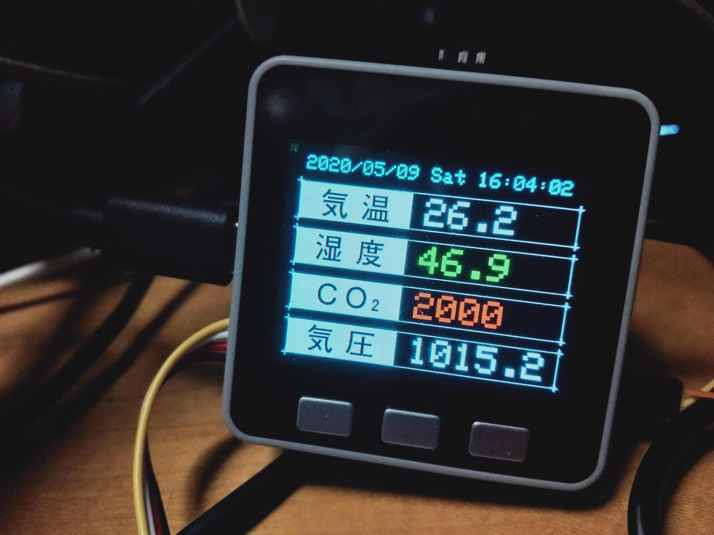

# M5Stack Room Monitoring Meter

Tempture, humidity, CO2 and pressure meter for M5Stack.

## Sensors

- [Adafruit Si7021 Temperature & Humidity Sensor](https://github.com/adafruit/Adafruit_Si7021)

- [Grove Barometer Sensor (BMP280)](https://wiki.seeedstudio.com/Grove-Barometer_Sensor-BMP280/)

- [IntelligentInfrared CO2 Module(Model: MH-Z19)](https://www.winsen-sensor.com/d/files/PDF/Infrared%20Gas%20Sensor/NDIR%20CO2%20SENSOR/MH-Z19%20CO2%20Ver1.0.pdf)

## Libraries

- [Adafruit_Si7021](https://github.com/adafruit/Adafruit_Si7021)
- [Seeed_BMP280](https://github.com/Seeed-Studio/Grove_BMP280)
- [MHZ19](https://github.com/WifWaf/MH-Z19)

## Usage

copy `assets/meter-bg.png` to your micro sd card and run.

## License
 
"M5Stack Room Monitoring Meter" is under [MIT license](https://en.wikipedia.org/wiki/MIT_License).
